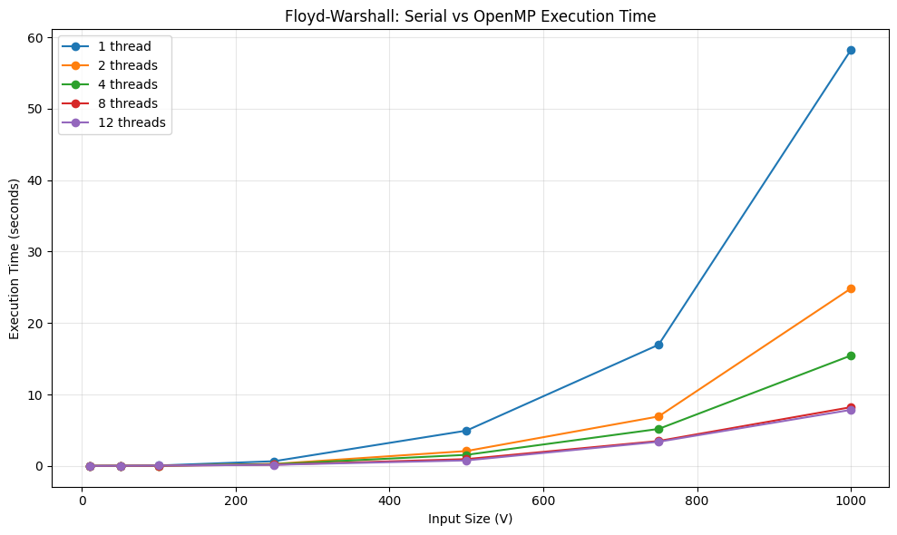

# Floyd-Warshall Algorithm — Serial vs OpenMP Parallel Implementation

## About the Project

Hello everyone! This repository contains implementations of famous algorithms that can benefit from parallel computing.

This folder contains both **serial and parallel implementations of the Floyd-Warshall algorithm using OpenMP**.

The objective of this project is to understand:

* How the Floyd-Warshall algorithm works.
* Which part of the algorithm can be parallelized.
* How OpenMP can be used to parallelize the computation.
* How execution time changes with increasing input size and number of threads.

Before discussing the performance improvement obtained through parallelism, let's first understand the Floyd-Warshall algorithm.

---

## What is the Floyd-Warshall Algorithm?

The **Floyd-Warshall algorithm** is an algorithm used to find the **shortest path between every pair of vertices** in a weighted graph.

Its time complexity is:

```text
O(V³)
```

where `V` is the number of vertices.

### A simple real-world example

Suppose you are the head of a manufacturing company and need to deliver products to customers located in thousands of cities.

Each city is connected to other cities by roads, and every road has a different transportation cost.

For example:

```text
        5
   A -------- B
   |          |
  10          2
   |          |
   C -------- D
        1
```

Suppose you want to find the cheapest way to travel from **A to D**.

There may be multiple possible routes:

```text
A → B → D
Cost = 5 + 2 = 7
```

or

```text
A → C → D
Cost = 10 + 1 = 11
```

Therefore, the shortest route is:

```text
A → B → D
Cost = 7
```

The Floyd-Warshall algorithm performs this process for **every possible pair of cities**.

So instead of asking:

> "What is the shortest path from A to D?"

we are asking:

> "What is the shortest path from every city to every other city?"

This is what makes Floyd-Warshall an **all-pairs shortest-path algorithm**.

---

## Floyd-Warshall vs Dijkstra

If you have heard about Dijkstra's algorithm, you may wonder how it differs from Floyd-Warshall.

The main difference is the number of source vertices considered.

### Dijkstra

Dijkstra solves the **single-source shortest-path problem**.

For example:

```text
Source = A

A → B
A → C
A → D
A → E
...
```

It finds the shortest distance from **one source vertex** to all other reachable vertices.

### Floyd-Warshall

Floyd-Warshall solves the **all-pairs shortest-path problem**.

It finds:

```text
A → B
A → C
A → D
...

B → A
B → C
B → D
...

C → A
C → B
C → D
...
```

In other words, it calculates the shortest distance between **every pair of vertices**.

---

# How Does Floyd-Warshall Work?

The core idea is to gradually allow vertices to act as **intermediate vertices**.

The main recurrence is:

```text
dist[i][j] = min(
    dist[i][j],
    dist[i][k] + dist[k][j]
)
```

Here:

* `i` = starting vertex
* `j` = destination vertex
* `k` = intermediate vertex

The algorithm asks:

> "Is going from `i → k → j` cheaper than directly going from `i → j`?"

If yes, we update the distance.

---

## Example Walkthrough

Consider this graph:

```text
A ----5---- B
|           |
10          2
|           |
C ----1---- D
```

Initial distance matrix:

```text
      A    B    C    D

A     0    5   10   INF
B   INF    0   INF   2
C   INF  INF    0    1
D   INF  INF  INF    0
```

`INF` means that there is currently no direct connection.

### Step 1: Use A as the intermediate vertex

The algorithm checks whether going through A gives us a shorter path.

For example:

```text
B → A → C
```

But there is no path from B to A, so nothing changes.

---

### Step 2: Use B as the intermediate vertex

Now we check paths through B.

For example:

```text
A → B → D
```

The cost is:

```text
A → B = 5
B → D = 2

Total = 5 + 2 = 7
```

Previously:

```text
A → D = INF
```

Therefore, we update:

```text
A → D = 7
```

---

### Step 3: Use C as the intermediate vertex

Now consider:

```text
A → C → D
```

The cost would be:

```text
A → C = 10
C → D = 1

Total = 11
```

But we already found:

```text
A → D = 7
```

Since:

```text
11 > 7
```

we don't update the distance.

---

### Step 4: Use D as the intermediate vertex

The algorithm checks whether going through D provides shorter paths.

After all vertices have been considered as intermediates, we have the shortest distance between every pair of vertices.

This is the basic idea behind the three nested loops:

```cpp
for (int k = 0; k < V; k++) {
    for (int i = 0; i < V; i++) {
        for (int j = 0; j < V; j++) {

            dist[i][j] = min(
                dist[i][j],
                dist[i][k] + dist[k][j]
            );

        }
    }
}
```

---

# How is Floyd-Warshall Parallelized?

The original algorithm contains three nested loops:

```cpp
for (int k = 0; k < V; k++) {
    for (int i = 0; i < V; i++) {
        for (int j = 0; j < V; j++) {
            ...
        }
    }
}
```

The important observation is that the `k` loop must remain **sequential**.

For example:

```text
k = 0
  ↓
k = 1
  ↓
k = 2
  ↓
k = 3
```

The calculations for `k = 1` depend on the updates made during `k = 0`.

Therefore, we cannot simply execute all values of `k` simultaneously.

However, for a fixed value of `k`, different values of `i` can be processed independently.

Therefore, we parallelize the `i` loop:

```cpp
for (int k = 0; k < V; k++) {

    #pragma omp parallel for
    for (int i = 0; i < V; i++) {

        for (int j = 0; j < V; j++) {
            ...
        }
    }
}
```

OpenMP distributes different rows of the distance matrix among different threads.

For example, with 4 threads:

```text
Thread 1 → rows 0, 1
Thread 2 → rows 2, 3
Thread 3 → rows 4, 5
Thread 4 → rows 6, 7
```

The exact distribution depends on the OpenMP scheduling configuration.

Thus, the overall structure becomes:

```text
                k = 0
                  │
        ┌─────────┼─────────┐
        ↓         ↓         ↓
     Thread 1  Thread 2  Thread 3 ...
        │         │         │
      rows      rows      rows
        │         │         │
        └─────────┼─────────┘
                  ↓
                k = 1
                  │
                 ...
```

This allows multiple rows to be processed simultaneously while preserving the required order of the `k` iterations.

---

# Performance Analysis

The following measurements were obtained by running the serial and OpenMP implementations with different input sizes and thread counts.

| Input Size (V) | 1 Thread | 2 Threads | 4 Threads | 8 Threads | 12 Threads |
| -------------: | -------: | --------: | --------: | --------: | ---------: |
|             10 |  0.000 s |   0.003 s |   0.003 s |   0.004 s |    0.005 s |
|             50 |  0.012 s |   0.008 s |   0.012 s |   0.016 s |    0.019 s |
|            100 |  0.057 s |   0.028 s |   0.024 s |   0.024 s |    0.041 s |
|            250 |  0.658 s |   0.278 s |   0.242 s |   0.167 s |    0.151 s |
|            500 |  4.934 s |   2.080 s |   1.548 s |   0.949 s |    0.769 s |
|            750 | 16.957 s |   6.922 s |   5.174 s |   3.485 s |    3.379 s |
|           1000 | 58.200 s |  24.822 s |  15.439 s |   8.215 s |    7.840 s |



### Observations

The results show that the benefit of parallelization becomes more visible as the input size increases.

For smaller matrices, the actual computation is relatively short, so the overhead associated with creating, scheduling, and synchronizing threads can become significant.

For larger matrices, there is substantially more computation that can be distributed among threads.

For example, for `V = 1000`:

```text
Serial      = 58.2 seconds
2 threads   = 24.822 seconds
4 threads   = 15.439 seconds
8 threads   = 8.215 seconds
12 threads  = 7.840 seconds
```

The 12-thread implementation therefore reduces the measured execution time from **58.2 seconds to 7.84 seconds** for this particular experiment.

The improvement is not perfectly proportional to the number of threads. This is expected because parallel programs are affected by factors such as thread-management overhead, synchronization, memory access, cache behavior, and the hardware's available computational resources.

---

# Conclusion

This project demonstrates how a computationally expensive `O(V³)` algorithm can benefit from parallel execution.

The key idea behind the parallel implementation is not to parallelize all three loops blindly. The `k` loop must maintain its sequential order because each iteration represents an additional set of allowed intermediate vertices. Instead, the independent work for different rows (`i`) is distributed among multiple OpenMP threads.

The experiments show that the advantage of parallelization becomes increasingly significant as the input size grows. For small inputs, parallel execution can even be slower because the overhead of managing multiple threads can be larger than the computation itself. For larger inputs, however, the computational workload is large enough for multiple threads to provide substantial reductions in execution time.

This project therefore demonstrates an important principle of parallel computing:

> **Parallelism is most effective when there is enough independent computation to outweigh the overhead of parallel execution.**

The project can be extended further by experimenting with different OpenMP scheduling strategies, larger matrices, different numbers of threads, and alternative parallel implementations of graph algorithms.
